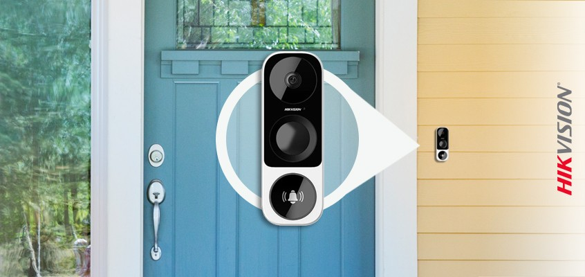
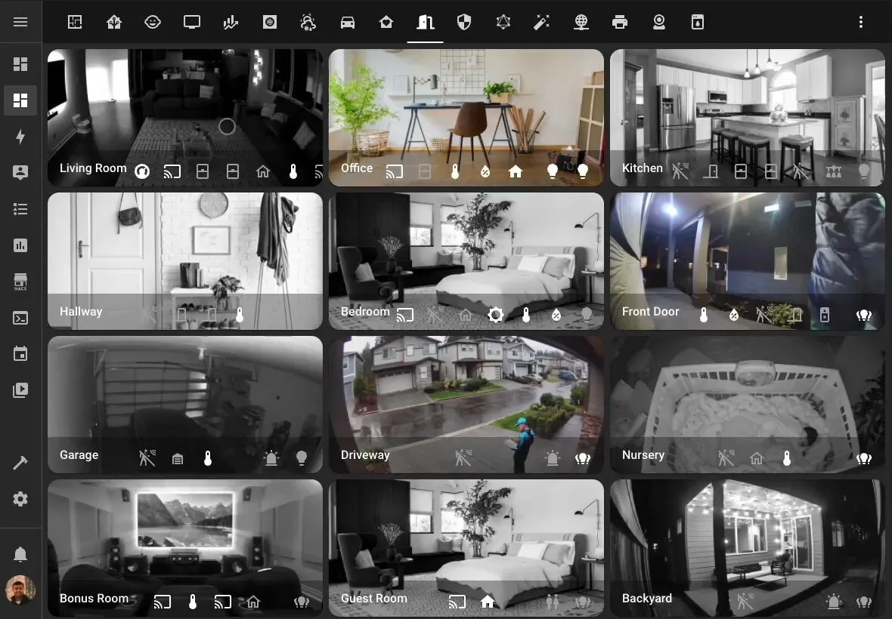

Müasir görüntülü qapı zəngləri (smart doorbell) çox vaxt məlumatları kənar serverlərə göndərir. Biz isə bütün görüntülərin yalnız sizin evinizdə qaldığı, **Frigate AI** və ya **Scrypted** əsaslı sistemlər qururuq.

*Şəkil 1: Qapı zənginə basıldıqda televizorda və telefonda anında canlı görüntü.*

### İnteqrasiyanın üstünlükləri:
1.  **AI İnsan Tanıma:** Sistem küləkdən tərpənən ağacla, qapınıza yaxınlaşan insanı fərqləndirir və yalnız vacib hallarda bildiriş göndərir.
2.  **İkitərəfli Səs:** Kuryer gəldikdə, evdə olmasanız belə Home Assistant tətbiqi vasitəsilə onunla danışa bilərsiniz.
3.  **Local NVR:** Heç bir aylıq abunə haqqı ödəmədən görüntüləri aylarla öz daxili diskinizdə saxlayın.

*Şəkil 2: Bütün kameraların tək bir paneldən (Dashboard) izlənilməsi.*

### Texniki Detallar:
Biz **RTSP** və ya **ONVIF** protokollarını dəstəkləyən kameralardan istifadə edirik. Bu, cihazların Home Assistant ilə "native" (doğma) şəkildə danışmasını təmin edir və gecikməni (latency) 1 saniyədən aşağı salır.
