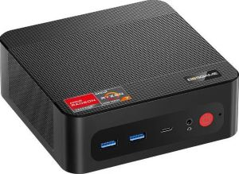
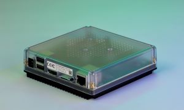
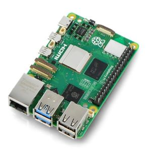
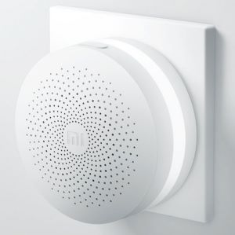
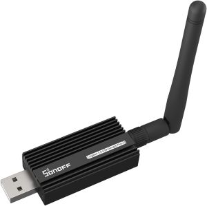

Home Assistant proqram təminatı nə qədər mükəmməl olsa da, o, üzərində işlədiyi hardware-in imkanları ilə məhdudlaşır. Stabil, sürətli və heç vaxt "donmayan" bir sistem qurmaq üçün düzgün komponentləri seçmək şərtdir.

### 1. Sistemin Beyni: Server Seçimi

Home Assistant qurmaq üçün bir neçə yolunuz var. Seçim sizin ehtiyacınızdan asılıdır:

    

* **Mini PC yada ən sadə Laptop (WindowsOS):** Bir mühəndis olaraq mənim tövsiyəm budur. SSD yaddaş və güclü prosessor sayəsində sistem anında reaksiya verir. Xüsusilə kamera inteqrasiyası (Frigate AI) planlaşdırırsınızsa, Mini PC ən stabil yoldur.

* **Home Assistant Green:** Rəsmi, həlldir. Konfiqurasiya ilə çox məşğul olmaq istəməyənlər üçün idealdır.

* **Raspberry Pi 4/5:** Başlanğıc üçün əladır, lakin SD kartların tez sıradan çıxma ehtimalı olduğu üçün mütləq **SSD** ilə istifadə edilməlidir.

### 2. Simsiz Rabitə: Gateway və Adapterlər

Biz "Tam Kabelsiz" sistem qurduğumuz üçün cihazların mərkəzi serverlə necə danışacağı çox vacibdir.

* **SkyConnect və ya Sonoff ZBDongle-E:** Bu USB adapterlər Home Assistant-ı bir **Zigbee və Thread** mərkəzinə çevirir. 
* **Mühəndis Məsləhəti:** USB adapteri birbaşa serverə taxmayın! USB 3.0 portları radio tezliklərinə maneə yaradır. Mütləq 1.5 metrlik bir USB uzadıcı kabeldən istifadə edin.

### 3. Enerji Təhlükəsizliyi: UPS (Uninterruptible Power Supply)

Sisteminiz nə qədər professional qurulsa da, elektrik kəsilməsi zamanı Linux verilənlər bazası (database) zədələnə bilər. Kiçik bir **Mini UPS** həm serverin, həm də internet routerin kəsilməz işini təmin edərək sistemin "uptime" göstəricisini 100%-ə yaxınlaşdırır.

---
* Avadanlıq seçərkən hər zaman 'Local Control' dəstəkləyən cihazlara üstünlük verin. Wi-Fi cihazlar şəbəkəni yükləyir, Zigbee isə öz 'Mesh' şəbəkəsini quraraq infrastrukturunuzu daha dayanıqlı edir."
