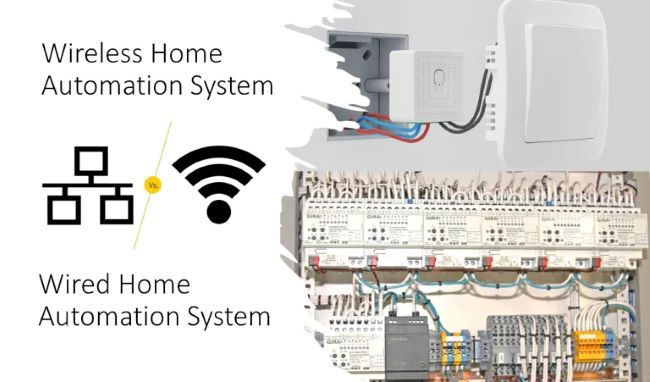

---

Əvvəllər “peşəkar ağıllı ev” dedikdə ağla yalnız divariçi kilometrlərlə kabel və bahalı mərkəzi panellər gəlirdi. Lakin paylanmış sistemlərin (**distributed systems**) inkişafı, bu yanaşmanı fundamental olaraq dəyişdi. 

Bu gün Home Assistant ilə qurulan kabelsiz sistemlər, klassik kabelli rəqiblərindən daha çevik, daha ucuz və ən əsası — daha ağıllıdır. Gəlin bu üstünlükləri mühəndislik prizmasından analiz edək.

---

### 1. Memarlıq Çevikliyi

Kabelli sistemlərdə (məsələn, KNX) bir sensorun yerini dəyişmək fiziki müdaxilə və yenidən montaj tələb edir. Bu, sistemin infrastruktura sərt bağlılığı (tight coupling) deməkdir.

Simsiz sistemlərdə isə cihazlar proqram səviyyəsində **decoupled** (ayrılmış) vəziyyətdədir. 

> *Mühəndis toxunuşu:* Bir obyektin (cihazın) yerini dəyişmək üçün infrastruktura toxunulmur; yalnız proqram təminatında konfiqurasiyanı (mapping) dəyişmək kifayətdir. Bu, sistemə inanılmaz bir modulyarlıq qazandırır.

---

### 2. Self-Healing Mesh Network (Özünü Bərpa Edən Şəbəkə)

Wired (kabelli) sistemlərdə mərkəzi şin (bus) və ya kabel qırılarsa, o xətt tamamilə sıradan çıxır. Bu, mühəndislikdə **Single Point of Failure (SPOF)** — yəni tək bir nöqtədən asılılıq adlanır.

Zigbee və ya Thread protokollarında isə hər bir cihaz həm də bir router rolunu oynayır.

**Üstünlük:** Əgər bir marşrut (path) kəsilərsə və ya maneə ilə qarşılaşarsa, məlumat avtomatik olaraq digər qonşu cihaz üzərindən mərkəzə çatır. Bu, sistemin dayanıqlığını (**redundancy**) və etibarlılığını (reliability) təmin edir.

---

### 3. Qiymət və Zaman Effektivliyi (CAPEX vs OPEX)

Kabelli sistemin quraşdırılması aylar çəkir və tikinti xərclərini (**CAPEX**) kəskin artırır. Simsiz həllər isə mühəndislik effektivliyi baxımından bir neçə addım öndədir:

* **Sürətli Deployment:** Bir gündə bütün evi "ağıllı" hala gətirmək mümkündür. 
* **Mərhələli Genişlənmə:** Sistem "paylanmış" olduğu üçün, bu gün bir otağı ağıllı edib, büdcəyə uyğun olaraq gələn ay digər hissələri əlavə edə bilərsiniz. 
---
### Nəticə

Biz mürəkkəb kabelləşməni proqram təminatı intellekti ilə əvəz edirik. Bu, həm büdcənizə qənaət edir, həm də gələcəkdə sistemi istədiyiniz kimi modifikasiya etmək azadlığı verir. Eviniz artıq statik bir bina deyil, sizinlə birlikdə böyüyən dinamik bir ekosistemdir.
