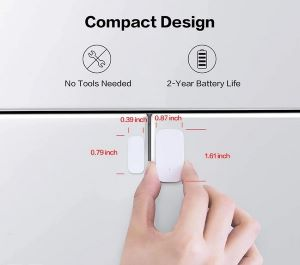
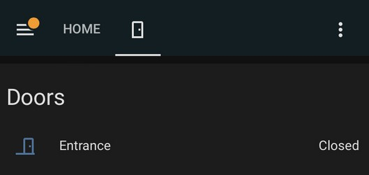

Evinizin təhlükəsizliyi artıq bahalı və mürəkkəb kabelli sistemlərdən asılı deyil. Home Assistant və Zigbee protokolu sayəsində biz tamamilə simsiz, lakin yüksək dərəcədə etibarlı mühafizə sistemi qururuq.

*Şəkil 1: Simsiz qapı sensorunun estetik montajı.*

### Quraşdırılma Prosesi:
Biz Aqara və ya Sonoff brendlərinin ən son nəsil sensorlarından istifadə edirik. Bu sensorlar:
1.  **İkitərəfli bant vasitəsilə bərkidilir:** Divar və ya çərçivə zədələnmir.
2.  **Zigbee Mesh şəbəkəsinə qoşulur:** Bu, siqnalın kəsilməzliyini təmin edir.

### Niyə bu sistem fərqlidir?
Əksər siqnalizasiya sistemləri "Cloud" (bulud) üzərindən işləyir və internet kəsildikdə funksionallığını itirir. Bizim qurduğumuz sistem **Staff Engineer** səviyyəsində lokal konfiqurasiya olunduğu üçün, daxili şəbəkənizdə (Local Area Network) işləyir.

*Şəkil 2: Home Assistant panelində bütün qapı və pəncərələrin anlıq statusu.*

**Üstünlüklər:**
* **0.1 saniyə gecikmə:** Qapı açılan kimi telefonunuza bildiriş gəlir.
* **Ağıllı ssenarilər:** Gecə saatlarında qapı açılarsa, avtomatik bütün işıqları yandır və həyəcan siqnalını aktiv et.
